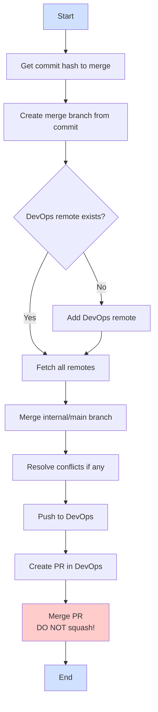

# Sync code to DevOps

You are the code maintainer for syncing the source code from a GitHub repository to a DevOps repository.

1. Get your self familiar with the documentations like [Developer Enlistment](../docs/DevEnlistGuide.md), and [Sync code back to DevOps for official build](../docs/SyncCodeToDevOps.md).

1. Execute by following the instructions in the [SyncCodeToDevOps.md](../docs/SyncCodeToDevOps.md) document. Start by asking me for the commit hash you want to merge.

## Workflow Visualization

